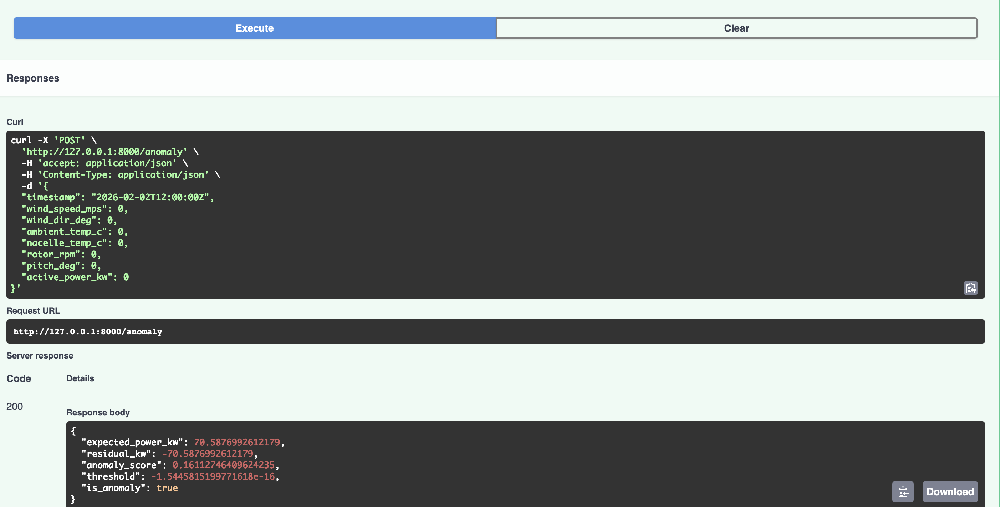

# Wind Turbine Asset Health — Anomaly Alerts (FastAPI + Streamlit + CI)





Rüzgâr türbini SCADA benzeri veriden **beklenen güç (expected power)** tahmini yapıp, gerçekleşen güç ile sapmayı (residual) kullanarak **anomali skoru** üreten uçtan uca bir demo sistem.

Bu repo “notebook’ta model” değil; küçük ölçekte **üretime yakın bir akış** gösterir:
**veri üretimi → model eğitimi → API servis → dashboard → test → CI**

---

## Neden önemli?
Rüzgâr santrallerinde performans kayıpları ve arıza öncü sinyalleri (icing, yaw misalignment, curtailment vb.) üretimi düşürür.
SCADA verisinden **erken uyarı / anomali tespiti**:
- plansız duruşları azaltmaya,
- bakım ekibinin doğru noktaya odaklanmasına,
- enerji üretim kaybını erken fark etmeye
yardımcı olur.

Bu proje, bu yaklaşımın **çalışan bir demo** örneğidir.

---

## Özellikler
- **Sentetik SCADA veri üretimi** (wind speed, direction, temps, rpm, pitch, power)
- **Expected Power modeli** (RandomForestRegressor)
- **Anomali modeli** (IsolationForest) + otomatik eşik (threshold)
- **FastAPI** ile servis:
  - `GET /health`
  - `POST /anomaly`
  - `POST /batch_anomaly`
- **Streamlit dashboard** ile görselleştirme
- **Pytest** ile uçtan uca test
- **GitHub Actions CI**: her push/PR’da otomatik test

---

## Repo Yapısı
```text
src/turbine_asset_health/
  data/make_dataset.py        # sentetik SCADA üretimi
  models/train.py             # expected power + anomaly model eğitimi
  models/infer.py             # tek kayıt skorlama
  app/main.py                 # FastAPI
  app/schemas.py              # Pydantic şemaları

dashboard/app.py              # Streamlit dashboard
tests/test_api.py             # API testleri
.github/workflows/ci.yml      # CI
